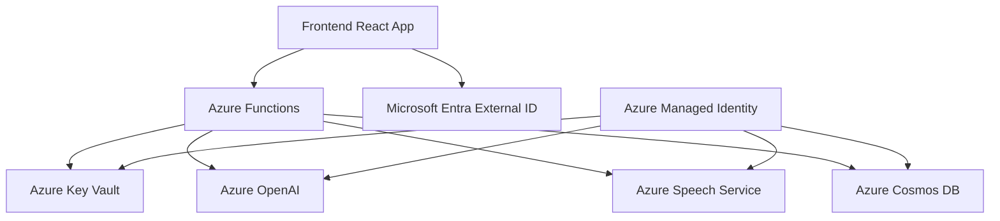

# Azure Services Setup Guide - Complete Overview

## 📋 Panduan Lengkap Setup Layanan Azure untuk VIRPAL App

Dokumen ini menyediakan overview lengkap dari semua layanan Azure yang digunakan dalam aplikasi VIRPAL beserta panduan setup yang telah dibuat.

## 🏗️ Arsitektur Layanan Azure



## 📚 Daftar Setup Guides

### 1. 🔐 [Azure Key Vault Setup Guide](./KEY_VAULT_SETUP_GUIDE.md)

**Fungsi**: Manajemen kredensial yang aman untuk semua layanan Azure

- ✅ Penyimpanan secrets tanpa hardcode credentials
- ✅ Integrasi dengan Managed Identity
- ✅ Circuit breaker pattern untuk reliability
- ✅ Development fallback untuk testing

**Key Features**:

- Secure proxy melalui Azure Functions
- Cache dengan TTL untuk performance
- Audit logging untuk compliance
- RBAC permissions

### 2. 🤖 [Azure OpenAI Setup Guide](./AZURE_OPENAI_SETUP_GUIDE.md)

**Fungsi**: AI chat completion dengan model GPT-4o-mini

- ✅ GPT-4o-mini model deployment
- ✅ Rate limiting dan quota management
- ✅ Content filtering configuration
- ✅ Performance monitoring

**Key Features**:

- Secure credential management via Key Vault
- Retry logic dengan exponential backoff
- Token usage monitoring
- Cost optimization

### 3. 🎤 [Azure Speech Service Setup Guide](./AZURE_SPEECH_SERVICE_SETUP_GUIDE.md)

**Fungsi**: Text-to-Speech dengan neural voice berkualitas tinggi

- ✅ Neural voice `en-US-Brian:DragonHDLatestNeural`
- ✅ Audio context management untuk browser
- ✅ Fallback ke Web Speech API
- ✅ Performance optimization

**Key Features**:

- Key Vault only credentials (no fallback)
- Connection pooling dan reuse
- Audio quality optimization
- Error handling yang comprehensive

### 4. 🗄️ [Azure Cosmos DB Setup Guide](./AZURE_COSMOS_DB_SETUP_GUIDE.md)

**Fungsi**: NoSQL database untuk users, conversations, messages, dan analytics

- ✅ Multi-container setup dengan optimal partitioning
- ✅ Session consistency level
- ✅ TTL untuk analytics data
- ✅ Query optimization

**Key Features**:

- Managed Identity authentication
- Batch operations untuk performance
- Request Unit monitoring
- Cross-region replication ready

### 5. ⚡ [Azure Functions Setup Guide](./AZURE_FUNCTIONS_SETUP_GUIDE.md)

**Fungsi**: Serverless backend API dan secure proxy

- ✅ Chat completion endpoint
- ✅ Key Vault proxy untuk frontend
- ✅ Health check monitoring
- ✅ CORS configuration

**Key Features**:

- Managed Identity untuk all Azure services
- Structured logging
- Application Insights integration
- Cold start optimization

### 6. 🔐 [Microsoft Entra External ID Setup Guide](./MICROSOFT_ENTRA_EXTERNAL_ID_SETUP_GUIDE.md)

**Fungsi**: Identity dan access management untuk external users

- ✅ CIAM user flows
- ✅ MSAL browser authentication
- ✅ Token management
- ✅ User profile handling

**Key Features**:

- Popup dan redirect authentication flows
- Silent token acquisition
- Custom UI branding
- Multi-tenant support

### 7. 🔑 [Azure Managed Identity Setup Guide](./AZURE_MANAGED_IDENTITY_SETUP_GUIDE.md)

**Fungsi**: Credential-free authentication antar layanan Azure

- ✅ System-assigned managed identity
- ✅ DefaultAzureCredential chain
- ✅ Role-based access control
- ✅ Cross-service authentication

**Key Features**:

- Zero credential management
- Automatic token rotation
- Principle of least privilege
- Audit trail untuk compliance

## 🚀 Quick Start Checklist

### Prerequisites

- [ ] ✅ Azure Subscription aktif
- [ ] ✅ Azure CLI installed dan authenticated
- [ ] ✅ Node.js 18+ dan npm installed
- [ ] ✅ Azure Functions Core Tools v4

### Setup Order (Recommended)

1. **[Azure Key Vault](./KEY_VAULT_SETUP_GUIDE.md)** - Setup terlebih dahulu untuk credential management
2. **[Azure Managed Identity](./AZURE_MANAGED_IDENTITY_SETUP_GUIDE.md)** - Enable untuk semua services
3. **[Microsoft Entra External ID](./MICROSOFT_ENTRA_EXTERNAL_ID_SETUP_GUIDE.md)** - Setup authentication
4. **[Azure Functions](./AZURE_FUNCTIONS_SETUP_GUIDE.md)** - Deploy backend services
5. **[Azure OpenAI](./AZURE_OPENAI_SETUP_GUIDE.md)** - Setup AI capabilities
6. **[Azure Speech Service](./AZURE_SPEECH_SERVICE_SETUP_GUIDE.md)** - Setup TTS
7. **[Azure Cosmos DB](./AZURE_COSMOS_DB_SETUP_GUIDE.md)** - Setup database

### Environment Variables Required

```bash
# Frontend (.env)
VITE_MSAL_CLIENT_ID=your-app-registration-id
VITE_TENANT_NAME=virpalapp
VITE_TENANT_DOMAIN=virpalapp.ciamlogin.com
VITE_USER_FLOW_NAME=B2C_1_signupsignin_virpal
VITE_BACKEND_SCOPE=https://virpalapp.onmicrosoft.com/virpal-api/user.read
VITE_AZURE_FUNCTION_ENDPOINT=https://virpal-functions.azurewebsites.net/api

# Azure Functions (local.settings.json)
{
  "Values": {
    "KEY_VAULT_URL": "https://virpal-key-vault.vault.azure.net/",
    "NODE_ENV": "production",
    "AZURE_CLIENT_ID": "system-assigned-managed-identity"
  }
}
```

## 🔐 Security Best Practices Applied

### 1. **Zero Hardcoded Credentials**

- ✅ Semua credentials disimpan di Azure Key Vault
- ✅ Managed Identity untuk service-to-service auth
- ✅ Environment variables hanya untuk non-sensitive config

### 2. **Network Security**

- ✅ HTTPS enforced untuk semua connections
- ✅ CORS properly configured
- ✅ Private endpoints ready untuk production

### 3. **Access Control**

- ✅ RBAC dengan principle of least privilege
- ✅ Regular access review procedures
- ✅ Audit logging enabled

### 4. **Data Protection**

- ✅ Encryption in transit dan at rest
- ✅ TTL untuk sensitive analytics data
- ✅ Secure token handling

## 📊 Monitoring dan Observability

### 1. **Application Insights**

```typescript
// Custom telemetry tracking
trackCustomMetric('ServiceHealth.KeyVault', 1, { status: 'healthy' });
trackCustomMetric('Performance.ChatCompletion', duration, {
  model: 'gpt-4o-mini',
});
trackCustomMetric('Usage.SpeechSynthesis', characterCount, { voice: 'Brian' });
```

### 2. **Azure Monitor**

- Request latency dan error rates
- Resource utilization (RU/s, token usage)
- Authentication success/failure rates
- Service availability metrics

### 3. **Cost Monitoring**

- Token consumption tracking
- Request Unit optimization
- Storage usage trends
- Function execution costs

## 🔍 Troubleshooting Quick Reference

### Common Issues

1. **Key Vault Access Denied**

   - Check Managed Identity is enabled
   - Verify RBAC permissions
   - Ensure correct Key Vault URL

2. **CORS Errors**

   - Verify CORS settings di Function App
   - Check allowed origins configuration
   - Ensure credentials support enabled

3. **Authentication Failures**

   - Check MSAL configuration
   - Verify redirect URIs
   - Test user flow settings

4. **Performance Issues**
   - Monitor Request Units (Cosmos DB)
   - Check token caching effectiveness
   - Review connection pooling

### Diagnostic Commands

```bash
# Test service connectivity
az keyvault secret list --vault-name "virpal-key-vault"
az cosmosdb show --name "virpal-cosmos" --resource-group "virpal-rg"
curl "https://virpal-functions.azurewebsites.net/api/health"

# Check permissions
az role assignment list --assignee "$MANAGED_IDENTITY_ID" --output table
```

## 🎯 Next Steps

### Production Readiness

- [ ] ✅ Enable private endpoints
- [ ] ✅ Configure backup policies
- [ ] ✅ Setup disaster recovery
- [ ] ✅ Implement monitoring alerts
- [ ] ✅ Security penetration testing

### Performance Optimization

- [ ] ✅ Enable auto-scaling policies
- [ ] ✅ Optimize database indexing
- [ ] ✅ Implement CDN untuk static assets
- [ ] ✅ Cache optimization review

### Compliance

- [ ] ✅ Data retention policies
- [ ] ✅ GDPR compliance review
- [ ] ✅ Security audit documentation
- [ ] ✅ Access control review

---

## 🆘 Support dan Resources

### Dokumentasi Resmi Azure

- [Azure Key Vault](https://docs.microsoft.com/azure/key-vault/)
- [Azure OpenAI Service](https://docs.microsoft.com/azure/cognitive-services/openai/)
- [Azure Speech Service](https://docs.microsoft.com/azure/cognitive-services/speech-service/)
- [Azure Cosmos DB](https://docs.microsoft.com/azure/cosmos-db/)
- [Azure Functions](https://docs.microsoft.com/azure/azure-functions/)
- [Microsoft Entra External ID](https://docs.microsoft.com/azure/active-directory-b2c/)

### Testing Tools

```bash
# Function testing
npm run functions:build && func host start

# Frontend testing
npm run dev

# Integration testing
npm run test:integration
```

---

**✅ Semua layanan Azure untuk aplikasi VIRPAL telah dikonfigurasi dengan Azure security best practices dan siap untuk production deployment!**
