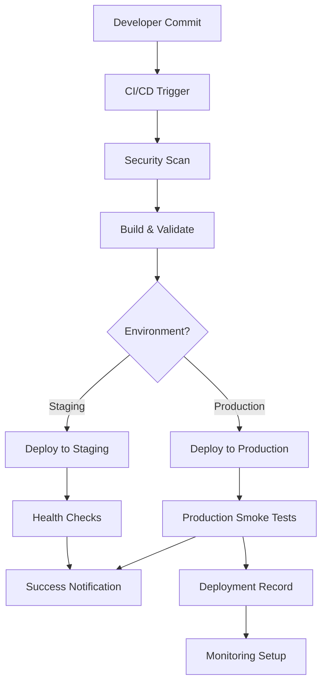

# VirPal App Deployment Guide - Enterprise Edition

## 🚀 **Consolidated Deployment System**

This guide covers the new enterprise-grade deployment system for VirPal App, incorporating Azure Functions v4 best practices, comprehensive security scanning, and multi-environment support.

## 📋 **Table of Contents**

1. [Overview](#overview)
2. [Prerequisites](#prerequisites)
3. [Quick Start](#quick-start)
4. [Deployment Scripts](#deployment-scripts)
5. [CI/CD Pipeline](#cicd-pipeline)
6. [Environment Configuration](#environment-configuration)
7. [Security Best Practices](#security-best-practices)
8. [Troubleshooting](#troubleshooting)

## 🎯 **Overview**

### **What's New**

- ✅ **Consolidated deployment script** (`deploy-virpal.ps1`) replaces multiple scripts
- ✅ **Enterprise CI/CD pipeline** with comprehensive validation
- ✅ **Multi-environment support** (local, staging, production)
- ✅ **Security scanning** integrated into deployment process
- ✅ **Automated rollback** capabilities
- ✅ **Performance monitoring** and health checks
- ✅ **Azure Functions v4** optimizations

### **Removed Scripts**

- ❌ `prepare-production-deployment.ps1` (functionality merged into main script)
- ❌ `prepare-deployment.ps1` (replaced by enhanced version)

## 🔧 **Prerequisites**

### **Required Software**

- **Node.js 20+** (Azure Functions v4 requirement)
- **PowerShell 7+** (for deployment scripts)
- **Azure CLI** (for production deployments)
- **Git** (for version control)

### **Azure Resources**

- **Azure Functions App** (staging and production)
- **Azure Key Vault** (for secrets management)
- **Azure Storage Account** (for frontend hosting)
- **Application Insights** (for monitoring)

### **GitHub Secrets**

Configure these secrets in your repository:

```bash
AZURE_CREDENTIALS_STAGING      # Service Principal for staging
AZURE_CREDENTIALS_PRODUCTION   # Service Principal for production
MONITORING_WEBHOOK             # Optional: Slack/Teams webhook
ALERT_WEBHOOK                  # Optional: Alert webhook
```

## 🚀 **Quick Start**

### **Local Development**

```powershell
# Validate your environment
npm run deploy:validate

# Build for development
npm run deploy:build-only

# Start local development
npm run dev
```

### **Staging Deployment**

```powershell
# Deploy to staging
npm run deploy:staging

# Or with PowerShell directly
pwsh scripts/deploy-virpal.ps1 -Environment staging -DeploymentType full-deploy
```

### **Production Deployment**

```powershell
# Deploy to production
npm run deploy:production

# Or with PowerShell directly
pwsh scripts/deploy-virpal.ps1 -Environment production -DeploymentType full-deploy -ProductionDomain "https://virpal.azurewebsites.net"
```

## 📜 **Deployment Scripts**

### **Main Script: `deploy-virpal.ps1`**

The consolidated deployment script supports multiple deployment types and environments.

#### **Parameters**

| Parameter | Type | Required | Description |
|-----------|------|----------|-------------|
| `Environment` | Choice | ✅ | `staging`, `production`, `local` |
| `DeploymentType` | Choice | ❌ | `build-only`, `full-deploy`, `validate-only` |
| `SkipTests` | Switch | ❌ | Skip running tests |
| `SkipSecurity` | Switch | ❌ | Skip security audit |
| `ProductionDomain` | String | ❌ | Required for production CORS |

#### **Usage Examples**

```powershell
# Validation only
.\scripts\deploy-virpal.ps1 -Environment local -DeploymentType validate-only

# Build without deployment
.\scripts\deploy-virpal.ps1 -Environment staging -DeploymentType build-only

# Full production deployment
.\scripts\deploy-virpal.ps1 -Environment production -DeploymentType full-deploy -ProductionDomain "https://virpal.azurewebsites.net"

# Quick staging deployment (skip tests)
.\scripts\deploy-virpal.ps1 -Environment staging -DeploymentType full-deploy -SkipTests
```

### **Package.json Scripts**

| Script | Description |
|--------|-------------|
| `npm run deploy:validate` | Validate environment and code quality |
| `npm run deploy:build-only` | Build without deployment |
| `npm run deploy:staging` | Full staging deployment |
| `npm run deploy:production` | Full production deployment |

## 🔄 **CI/CD Pipeline**

### **Pipeline Features**

- ✅ **Automated security scanning** with Trivy
- ✅ **Multi-environment deployment** (staging/production)
- ✅ **Comprehensive validation** before deployment
- ✅ **Health checks** with retry logic
- ✅ **Rollback capabilities** on failure
- ✅ **Artifact management** with retention policies
- ✅ **Production smoke tests**

### **Workflow Triggers**

| Branch | Event | Environment | Action |
|--------|-------|-------------|--------|
| `develop` | Push | Staging | Auto-deploy |
| `main` | Push | Production | Auto-deploy |
| Manual | Workflow Dispatch | User Choice | Manual deploy |

### **Pipeline Stages**

1. **Security Scan** - Vulnerability scanning with Trivy
2. **Build & Validate** - Comprehensive validation and build
3. **Deploy Staging** - Staging environment deployment
4. **Deploy Production** - Production environment deployment
5. **Cleanup** - Artifact cleanup

## ⚙️ **Environment Configuration**

### **Staging Environment**

```yaml
Environment Variables:
- NODE_ENV: staging
- AZURE_FUNCTIONS_ENVIRONMENT: staging
- Log Level: verbose

Features:
- Relaxed security audit (high level)
- Extended timeout for debugging
- Detailed logging enabled
```

### **Production Environment**

```yaml
Environment Variables:
- NODE_ENV: production
- AZURE_FUNCTIONS_ENVIRONMENT: production
- Log Level: error

Features:
- Strict security audit (moderate level)
- CORS validation for production domain
- Performance optimizations
- Monitoring and alerting
```

## 🔒 **Security Best Practices**

### **Implemented Security Measures**

1. **Dependency Scanning**
   - npm audit with environment-specific levels
   - Trivy vulnerability scanning
   - SARIF upload to GitHub Security tab

2. **Code Quality**
   - TypeScript compilation validation
   - ESLint enforcement
   - Development code detection in production

3. **Azure Security**
   - Managed Identity authentication
   - Key Vault integration
   - CORS validation for production
   - Secure environment variable handling

4. **Deployment Security**
   - No hardcoded secrets
   - Environment-specific validations
   - Rollback on security failures

### **Security Validations**

| Check | Staging | Production |
|-------|---------|------------|
| npm audit level | high | moderate |
| Development code | warn | error |
| Hardcoded variables | warn | error |
| CORS validation | skip | required |

## 🏗️ **Architecture Overview**

### **Deployment Flow**



### **Package Structure**

```
deployment/
├── frontend/          # Built React app for Static Web Apps
├── backend/           # Compiled Azure Functions
├── manifest.json      # Deployment metadata
└── deployment-record.json  # Production deployment record
```

## 🔧 **Troubleshooting**

### **Common Issues**

#### **PowerShell Execution Policy**

```powershell
# If script execution is blocked
Set-ExecutionPolicy -ExecutionPolicy RemoteSigned -Scope CurrentUser
```

#### **Node.js Version Mismatch**

```powershell
# Check Node.js version
node --version

# Should output v20.x.x
# Install Node.js 20 if different version
```

#### **Azure CLI Authentication**

```powershell
# Login to Azure CLI
az login

# Set default subscription
az account set --subscription "your-subscription-id"
```

#### **Permission Issues**

```powershell
# Make script executable
chmod +x scripts/deploy-virpal.ps1

# Or use PowerShell directly
pwsh scripts/deploy-virpal.ps1 -Environment local -DeploymentType validate-only
```

### **Deployment Failures**

#### **Health Check Failures**

1. **Check Azure Functions logs**:
   ```powershell
   az functionapp logs tail --name your-function-app --resource-group your-rg
   ```

2. **Verify environment variables**:
   ```powershell
   az functionapp config appsettings list --name your-function-app --resource-group your-rg
   ```

3. **Check Key Vault access**:
   ```powershell
   az keyvault secret show --vault-name your-keyvault --name test-secret
   ```

#### **Build Failures**

1. **Check TypeScript errors**:
   ```powershell
   npx tsc --noEmit
   ```

2. **Verify dependencies**:
   ```powershell
   npm audit
   npm ci
   ```

3. **Clean build cache**:
   ```powershell
   npm run clean:dist
   rm -rf node_modules/.cache
   ```

### **Rollback Procedures**

#### **Automated Rollback**

The pipeline includes automated rollback triggers:
- Health check failures after 10 attempts
- Smoke test failures
- Critical security vulnerabilities

#### **Manual Rollback**

```powershell
# Use the rollback script
pwsh scripts/rollback-deployment.ps1 -Environment production -TargetVersion "previous"

# Or redeploy previous version
git checkout previous-tag
npm run deploy:production
```

## 📊 **Monitoring and Observability**

### **Built-in Monitoring**

1. **Health Checks**
   - Automatic retry logic
   - Environment-specific timeouts
   - Endpoint validation

2. **Performance Monitoring**
   - Build size tracking
   - Deployment duration
   - Function count validation

3. **Notifications**
   - Success/failure webhooks
   - Deployment records
   - Git tag creation

### **Logs and Artifacts**

- **Deployment logs**: `deployment-*.log`
- **Build artifacts**: Retained for 30 days
- **Deployment summary**: JSON format with metrics
- **GitHub Actions logs**: Complete pipeline history

## 🔗 **Related Documentation**

- [CI/CD Configuration Guide](CI_CD_CONFIGURATION.md)
- [Error Resolution Summary](ERROR_RESOLUTION_SUMMARY.md)
- [Azure Functions Best Practices](AZURE_FUNCTIONS_LOGGING_BEST_PRACTICES.md)
- [Key Vault Integration](KEY_VAULT_INTEGRATION_COMPLETE.md)

## 📞 **Support**

For deployment issues or questions:

1. Check the troubleshooting section above
2. Review deployment logs in `deployment-*.log`
3. Check GitHub Actions pipeline logs
4. Verify Azure resource configurations

---

**Last Updated**: January 2025  
**Version**: 2.0 (Enterprise Edition)  
**Compatibility**: Azure Functions v4, Node.js 20+, PowerShell 7+
