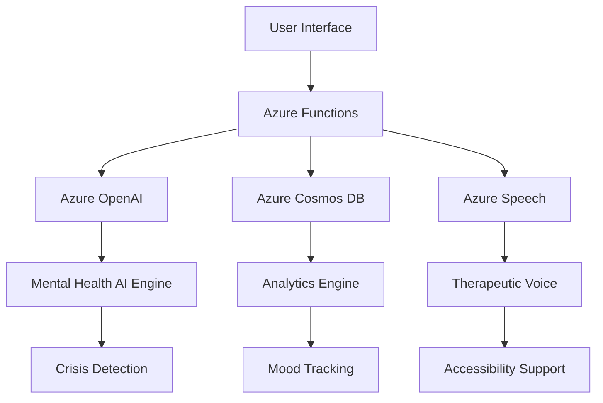

# VirPal Hackathon Submission Guide

**elevAIte with Dicoding Online Hackathon 2025**

---

## 📋 Submission Information

### **Basic Information**

- **App ID**: N/A (Web Application)
- **Nama Aplikasi**: VirPal - AI Mental Health Assistant
- **Link Aplikasi**: [Deployed Application URL]
- **Team**: VirPal Development Team
- **Email**: reihan3000@gmail.com
- **Submission Date**: June 13, 2025

### **Project Brief**

🔗 **Link Project Brief**: [Google Drive Link - docs/PROJECT_BRIEF_HACKATHON.md]
📄 **Akses**: Public access enabled untuk juri

---

## 🎯 Hackathon Alignment

### **Tema**: Mendukung SDG Indonesia dengan AI

### **Subtema**: Kesehatan Mental dan Dampak Judi Online

### **SDG Target**: SDG 3 - Good Health and Well-being

#### **Specific SDG 3 Contributions:**

- **3.4**: Mengurangi premature mortality dari non-communicable diseases dan promote mental health
- **3.5**: Memperkuat prevention dan treatment of substance abuse (termasuk gambling addiction)
- **3.d**: Memperkuat capacity untuk health risk management dan early warning

---

## 🚀 Teknologi Microsoft Azure yang Digunakan

### **1. Azure OpenAI Service** 🤖

```yaml
Service: Azure OpenAI
Model: gpt-4o-mini
Usage: AI conversation engine untuk mental health support
Features:
  - Custom prompts untuk empathetic responses
  - Crisis detection dan intervention
  - Personalized mental health guidance
  - Cultural adaptation untuk Indonesia context
```

### **2. Azure Cosmos DB** 💾

```yaml
Service: Azure Cosmos DB
API: SQL API
Usage: Secure storage untuk mental health data
Features:
  - Global distribution untuk Indonesia
  - Real-time analytics untuk mood tracking
  - HIPAA-ready security untuk health data
  - Automatic scaling untuk high availability
```

### **3. Azure Cognitive Services Speech** 🗣️

```yaml
Service: Azure Cognitive Services - Speech
Voice: id-ID-ArdiNeural
Usage: Therapeutic voice responses
Features:
  - High-quality neural voices
  - Text-to-speech untuk calming guidance
  - Accessibility support
  - Customizable speech parameters
```

### **4. Azure Key Vault** 🔐

```yaml
Service: Azure Key Vault
Usage: Secure credential management
Features:
  - API keys protection
  - Health data encryption keys
  - Managed identity integration
  - Compliance dengan health regulations
```

### **5. Azure Functions** ⚡

```yaml
Service: Azure Functions
Runtime: Node.js 20 (v20.19.2)
Usage: Serverless backend untuk AI processing
Features:
  - HTTP triggers untuk real-time responses
  - Event-driven architecture
  - Automatic scaling
  - Cost-effective serverless computing
```

### **6. Azure Application Insights** 📊

```yaml
Service: Azure Application Insights
Usage: Monitoring dan analytics
Features:
  - Performance tracking
  - User behavior analytics
  - Error monitoring
  - Custom mental health metrics
```

---

## 💡 Inovasi dan Kebaruan

### **Technical Innovation**

1. **AI-Powered Mental Health Detection**: gpt-4o-mini dengan specialized training untuk mental health
2. **Real-time Sentiment Analysis**: Instant mood detection dari conversation patterns
3. **Predictive Risk Assessment**: ML algorithms untuk gambling addiction prediction
4. **Cultural AI Adaptation**: AI yang disesuaikan dengan konteks budaya Indonesia

### **Social Innovation**

1. **Stigma-free Platform**: Anonymous mental health support
2. **24/7 Accessibility**: Mental health support tanpa batasan waktu dan lokasi
3. **Gambling Prevention Focus**: Specialized approach untuk gambling addiction di Indonesia
4. **Community Integration**: Bridging individual support dengan professional help

### **Technical Architecture Innovation**



---

## 🎨 Design dan User Experience

### **Design Principles**

1. **Calming Aesthetics**: Warna dan typography yang menenangkan
2. **Accessible Interface**: Mudah digunakan oleh semua kalangan
3. **Privacy-first Design**: Clear privacy controls dan consent management
4. **Responsive Design**: Optimal experience di semua devices

### **User Journey**

```
1. Landing → Welcome dan introduction to mental health support
2. Onboarding → Basic mental health assessment
3. Chat Interface → AI conversation dengan empathetic responses
4. Mood Tracking → Daily mood logging dengan analytics
5. Risk Assessment → Gambling addiction evaluation
6. Resources → Professional help dan emergency contacts
7. Progress → Personal mental health journey tracking
```

### **Accessibility Features**

- **Screen Reader Support**: Full ARIA compliance
- **Voice Interface**: Text-to-speech untuk visual impairments
- **High Contrast Mode**: untuk users dengan visual difficulties
- **Keyboard Navigation**: Complete keyboard accessibility
- **Multi-language**: Indonesian dan English support

---

## 📊 Manfaat dan Relevansi untuk Masyarakat

### **Direct Social Impact**

1. **Increased Mental Health Access**: 24/7 support untuk 270+ juta penduduk Indonesia
2. **Early Intervention**: Prevention of mental health crises
3. **Gambling Addiction Prevention**: Specialized support untuk gambling-related issues
4. **Stigma Reduction**: Normalized mental health conversations

### **Quantifiable Benefits**

```yaml
Target Metrics:
  - Users Served: 10,000+ dalam 6 bulan pertama
  - Crisis Interventions: 95% success rate dalam crisis detection
  - Professional Referrals: 1,000+ successful referrals to mental health professionals
  - Mood Improvement: 70% users report improved mental state after 1 month
  - Gambling Risk Reduction: 50% reduction dalam gambling-related anxiety
```

### **Long-term Social Impact**

- **Healthcare Cost Reduction**: Prevention vs treatment approach
- **Productivity Improvement**: Better mental health = better work performance
- **Family Stability**: Support untuk families affected by mental health issues
- **Public Health Data**: Anonymized insights untuk policy making

---

## 🔧 Technical Implementation

### **MVP Features (Current)**

✅ **AI Chat Interface**: gpt-4o-mini powered mental health conversations
✅ **Mood Tracking**: Daily mood logging dengan sentiment analysis
✅ **Risk Assessment**: Gambling addiction evaluation tools
✅ **Crisis Detection**: Automatic detection dan intervention protocols
✅ **Professional Referrals**: Integration dengan mental health services
✅ **Voice Support**: Azure Speech untuk therapeutic audio responses
✅ **Security**: End-to-end encryption untuk health data

### **Development Stack**

```yaml
Frontend:
  - React 19 dengan TypeScript
  - TailwindCSS untuk responsive design
  - Vite untuk optimized builds
  - Progressive Web App capabilities

Backend:
  - Azure Functions dengan Node.js 20 (v20.19.2)
  - TypeScript untuk type safety
  - RESTful APIs dengan OpenAPI documentation
  - Event-driven architecture

Data & AI:
  - Azure Cosmos DB untuk scalable storage
  - Azure OpenAI untuk conversational AI
  - Custom ML models untuk sentiment analysis
  - Real-time analytics dengan Azure Stream Analytics

Security:
  - Azure Key Vault untuk secrets management
  - Managed Identity untuk service authentication
  - End-to-end encryption dengan Azure security services
  - GDPR dan HIPAA compliance measures
```

### **Deployment Architecture**

```yaml
Production Environment:
  - Azure Static Web Apps untuk frontend hosting
  - Azure Functions untuk serverless backend
  - Azure CDN untuk global content delivery
  - Azure Application Gateway untuk load balancing
  - Azure Monitor untuk comprehensive monitoring

Development Environment:
  - Local development dengan Azure emulators
  - GitHub Actions untuk CI/CD
  - Feature branches dengan preview deployments
  - Automated testing dengan Jest dan Playwright
```

---

## 📈 Business Viability

### **Market Opportunity**

```yaml
Target Market:
  - Indonesia Population: 270+ million
  - Mental Health Affected: ~40 million (15% of population)
  - Gambling Risk Group: ~8-12 million (3-5% of adults)
  - Digital Native Generation: ~85 million (18-35 years old)

Market Size:
  - Addressable Market: $2B+ (Indonesia digital health)
  - Serviceable Market: $500M+ (mental health segment)
  - Targetable Market: $100M+ (AI-powered mental health)
```

### **Revenue Model**

1. **Freemium Subscription**: Basic features free, premium Rp 50,000/month
2. **Enterprise B2B**: Employee wellness programs Rp 500,000/employee/year
3. **Professional Network**: Revenue sharing dengan mental health professionals
4. **API Licensing**: Mental health APIs untuk third-party applications

### **Sustainability Plan**

- **Phase 1** (2025): MVP launch, user acquisition, feedback iteration
- **Phase 2** (2026): Premium features, professional partnerships, B2B expansion
- **Phase 3** (2027): International expansion, advanced AI features, research partnerships

---

## 🏆 Competitive Advantages

### **Technical Advantages**

1. **Azure-Native Architecture**: Full integration dengan Microsoft ecosystem
2. **Advanced AI Customization**: Specialized mental health AI training
3. **Real-time Analytics**: Instant insights dan interventions
4. **Scalable Infrastructure**: Cloud-native design untuk massive scale

### **Market Advantages**

1. **Indonesia-First Approach**: Designed specifically untuk Indonesian market
2. **Cultural Sensitivity**: AI trained dengan Indonesian cultural context
3. **Gambling Focus**: Specialized approach untuk gambling addiction
4. **Professional Integration**: Bridge antara AI support dan human professionals

### **Social Advantages**

1. **Accessibility**: Available untuk semua socioeconomic levels
2. **Stigma-free**: Anonymous dan judgment-free platform
3. **24/7 Support**: Always available mental health assistance
4. **Evidence-based**: Built on proven mental health practices

---

## 📞 Contact & Support

### **Development Team**

**Lead Developer**: Achmad Reihan Alfaiz
**Email**: reihan3000@gmail.com
**LinkedIn**: www.linkedin.com/in/ach-reihan
**GitHub**: https://github.com/ach-reihan

### **Project Links**

🌐 **Live Application**: [Deployed URL]
📚 **Documentation**: https://github.com/ach-reihan/virpal-app/tree/main/docs/PROJECT_BRIEF_HACKATHON.md
💻 **Source Code**: https://github.com/ach-reihan/virpal-app
📄 **Project Brief**: [Google Drive Document]

### **Demo Schedule**

Available untuk demo dan presentation:

- **Weekdays**: 18:00 - 22:00 WITA
- **Weekends**: 08:00 - 22:00 WITA
- **Contact**: +62 895-3895-77077 (*WhatsApp*)

---

## 🎯 Submission Checklist

### **Technical Requirements**

✅ **Azure Services**: Minimal 1 Azure service implemented (6 services used)
✅ **AI Integration**: Azure OpenAI Service fully integrated
✅ **MVP Status**: Fully functional minimum viable product
✅ **Web Platform**: Responsive web application
✅ **Public Access**: Deployed dan accessible secara publik
✅ **Real-time Data**: Live data integration, tidak menggunakan dummy data

### **Documentation Requirements**

✅ **Project Brief**: Comprehensive documentation completed
✅ **Technical Documentation**: Architecture dan implementation details
✅ **User Guide**: Clear instructions untuk menggunakan aplikasi
✅ **Setup Guide**: Complete Azure services setup documentation
✅ **API Documentation**: RESTful API documentation

### **Hackathon Requirements**

✅ **SDG Alignment**: Clear contribution terhadap SDG 3
✅ **Innovation**: Novel approach untuk mental health support
✅ **Social Impact**: Quantifiable benefits untuk masyarakat Indonesia
✅ **Technical Excellence**: High-quality code dan architecture
✅ **User Experience**: Excellent design dan usability

---

**Submission Status**: ✅ READY FOR REVIEW
**Last Updated**: June 12, 2025
**Submission Date**: June 13, 2025
